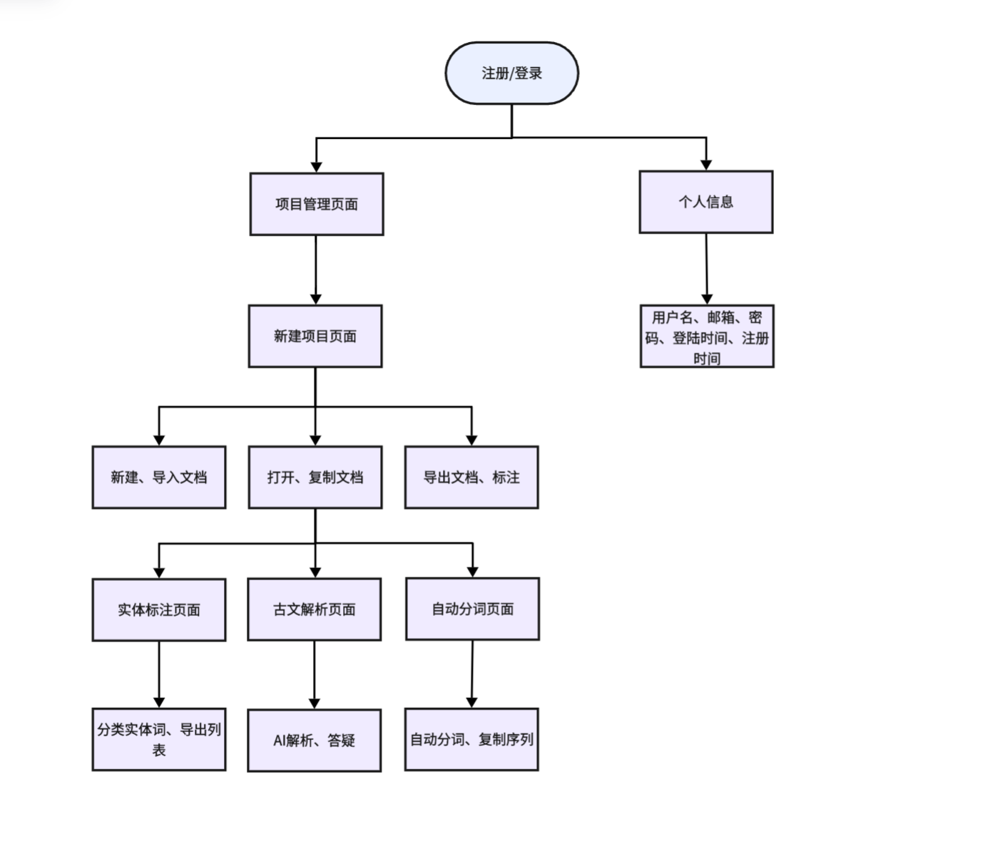

# AncientChinese

汉语智能标注平台 - 古汉语文本处理与标注系统

## 团队成员

| 姓名   | 学号       | 分工     |
| ------ | ---------- | -------- |
| 周芷伊 | 2312190211 | 前端     |
| 朱孔峥 | 2312190231 | 后端     |
| 张贤文 | 2312190210 | api+联调 |

## 项目简介

AncientChinese 是一个面向古汉语文本研究与教学的智能标注平台，旨在为古文资料的整理、分析与利用提供高效便捷的工具支持。平台集成了项目管理、文本处理、实体标注与智能问答等多种功能，能够帮助用户对古汉语文献进行结构化处理与语义分析。系统支持基于 jieba 的自动分词，并结合人工标注与 AI 自动标注技术，对人物、地名、时间等实体信息进行识别与标注。同时，平台接入大语言模型，实现对古文内容的智能解析与问答，辅助用户理解复杂语句与历史背景。用户还可以对项目和文档进行统一管理，并将完成标注的数据进行导出，便于后续研究、统计分析或数据共享，从而提升古汉语文本处理与研究的效率。

## 主要功能

- **项目与文档管理**：支持项目增删改查、文档增删改查导入导出

- **实体标注**：手动标注或 AI 自动标注人物、地名、时间、等实体

- **古文答疑解析**：基于 AI 大模型对古文内容进行提问和智能答疑解析

- **自动分词**：基于 jieba 的中文分词功能

- **数据导出**：将完成标注的文档进行导出

  

## 项目结构

```
AncientChinese/
├── docs/                 
│   ├── frontend.md         # 前端说明
│   ├── backend.md             # 后端说明
│   └── api.md                # API设计
├── frontend/                # 前端代码             
├── backend/              # 后端代码
├── .gitignore        
└── README.md            # 项目整体说明
```

## 技术栈

### 前端
- 原生 HTML/CSS/JavaScript

### 后端
- Python+FastAPI

### 数据库

- MySQL
