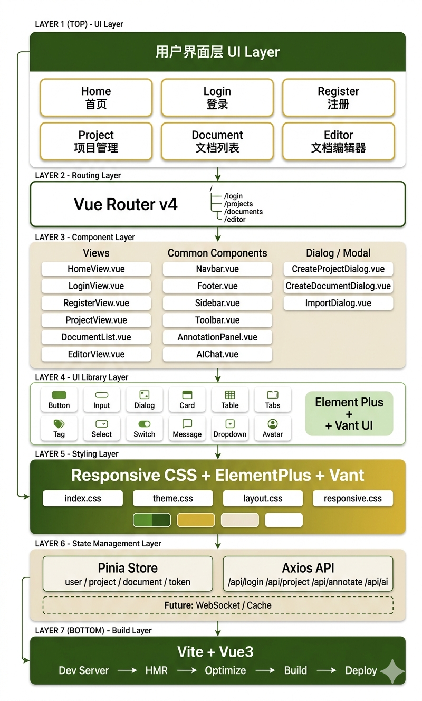
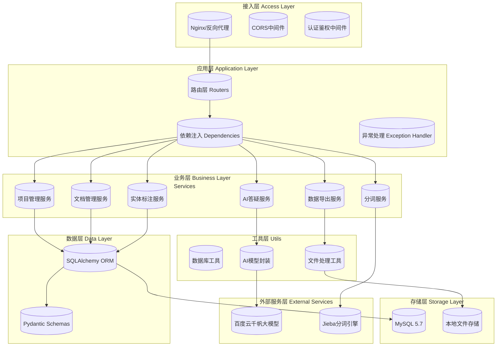

# 架构设计文档

## 前端架构

## 后端架构

### 服务模块划分

## 技术选型确认

| 层级     | 选择    | 理由                                                         |
| -------- | ------- | ------------------------------------------------------------ |
| 前端框架 | Vue3+Vite | Vue3 采用组件化开发模式，结构清晰，易于维护;Vite支持 ESModule,配置简单,官方推荐 Vue3 使用 |
| 后端框架 | FastAPI | 选用FastAPI的核心原因在于其原生异步架构能够高效处理ai大模型的长耗时调用，避免请求阻塞；同时框架内置的自动API文档生成和Pydantic数据校验机制，能显著提升开发效率并降低前后端协作成本，非常适合AI密集型的古汉语标注场景 |
| 数据库   | 阿里云 MySQL 云数据库 | 选用阿里云托管 MySQL（RDS）作为后端数据存储，具有自动备份、高可用、弹性扩展等特性，支持公网访问与安全控制，便于课程环境下的远程开发与部署，同时完全兼容标准 MySQL 协议，方便与 FastAPI 后端及现有工具链集成 |
| 部署方式 |         |                                                              |

