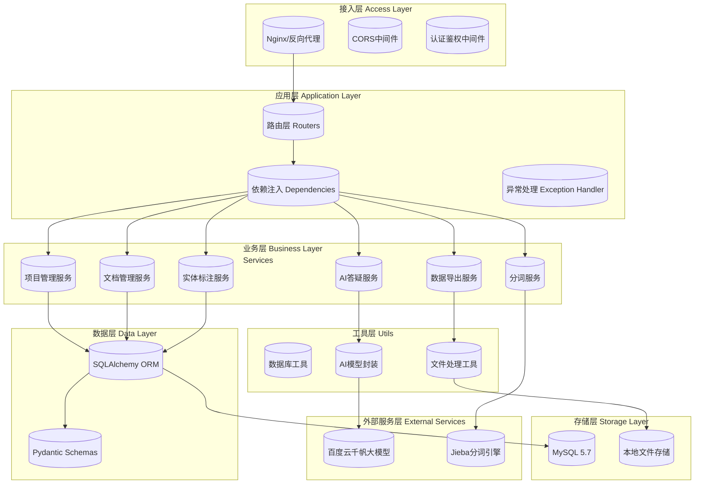

# 软件架构设计贡献说明

姓名：朱孔峥

学号：2312190231

日期：2026-3-22

## 我完成的工作

### 1.架构设计

-后端架构设计

### 2.技术选型

后端框架选择：FastAPI

理由：选用FastAPI的核心原因在于其原生异步架构能够高效处理ai大模型的长耗时调用，避免请求阻塞；同时框架内置的自动API文档生成和Pydantic数据校验机制，能显著提升开发效率并降低前后端协作成本，非常适合AI密集型的古汉语标注场景。

### 3.环境搭建

后端项目初始化

### 4.文档编写

-architecture.md

-database.md

## 心得体会

更加清晰地理解了项目架构，同时也了解到了许多后端框架，对E-R图的设计更加熟悉。