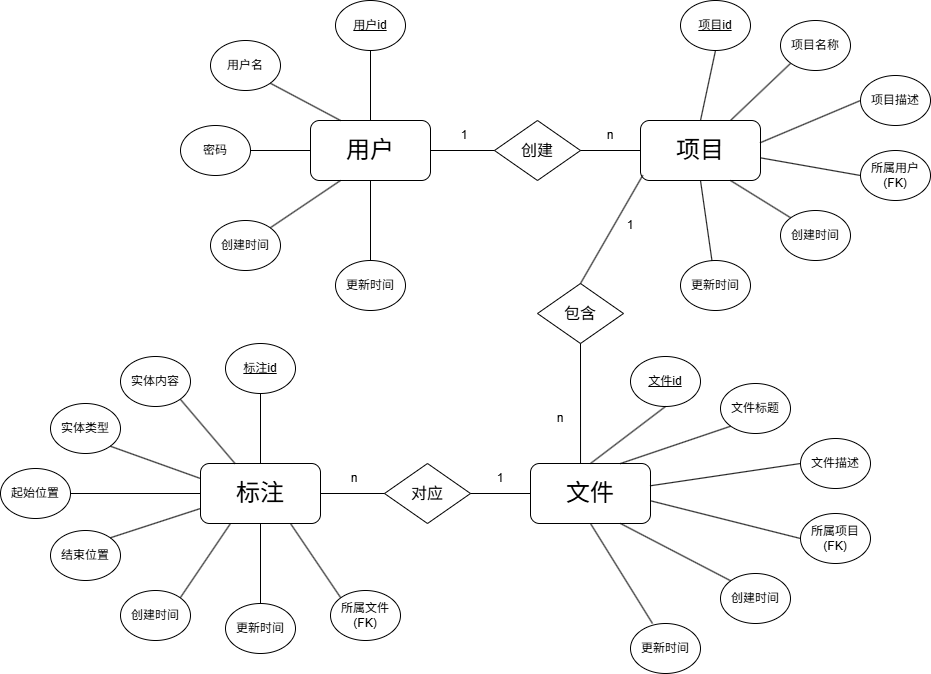

# 后端开发贡献说明

姓名：朱孔峥

学号：2312190231

日期：2026-4-12

## 我完成的工作

### API 实现

- 用户认证 API（注册 / 登录）
- 密码加密
- 文件导入导出
- 荀子大模型服务

- 业务资源 1 CRUD：用户
- 业务资源 2 CRUD：项目
- 业务资源 3 CRUD：文档
- 业务资源 4 CRUD：标注
- 统一错误响应

### 数据库

- 数据模型定义：

- ORM 配置

