# **古文智能标注助手**

作者:

- 朱孔峥(2312190231)
- 张贤文(2312190210)
- 周芷伊(2312190211)

介绍：

## 一、项目介绍 \[周芷伊、张贤文、朱孔峥]

### 1.1 背景与问题陈述

随着数字人文研究不断推进，越来越多的古籍文献被扫描、整理并转化为可检索的数字文本，但文本进入数字化阶段并不意味着后续工作已经完成。对于古汉语文本而言，真正支撑研究与教学的，往往是后续的分词、实体识别、语义解释、重点信息提取和结构化整理，而这些工作如果长期依赖人工完成，不仅效率较低，而且对标注规范的一致性和人员经验也有较高要求。尤其在课程教学、小型课题整理和专题研究中，重复性的基础工作会消耗大量时间。

本项目正是在这一背景下提出。我们希望构建一个面向古汉语文本研究与教学的智能标注平台，把项目管理、文档管理、实体标注、自动分词、古文解析和智能问答整合到统一系统中，让用户能够围绕一篇古文完成从录入、整理到分析的完整流程。平台强调的是“人工可控 + 智能辅助”，既不完全依赖自动化，也不让使用者陷入繁琐的纯手工处理，从而更有效地服务古文学习、课堂演示和资料研究。

### 1.2 项目目标与核心功能

本项目的目标并不是简单展示几个分散的功能页面，而是搭建一套能够真正支撑古文处理流程的基础平台。围绕这一目标，系统采用前后端分离架构，用户可以先建立项目，再将具体文本纳入文档体系中管理，随后根据实际需要进行手动标注或调用智能功能辅助分析。这样的设计既适合教师按专题组织教学材料，也适合学生围绕单篇古文进行细读和练习，同时也能为课题组积累结构化文本数据提供基础支撑。

在功能层面，平台目前已经形成较为完整的核心链路。系统支持项目与文档管理，方便用户按主题组织文本资料；支持实体标注，既可以手动标注人物、地名、时间等信息，也可以调用 AI 辅助完成自动识别；支持自动分词与古文解析，帮助用户更快进入文本理解阶段；同时接入大语言模型，提供围绕当前文档内容的智能问答能力。为了便于使用，这些功能都尽量通过可视化方式呈现，让用户可以在阅读原文的同时查看标注、分词和解析结果。

### 1.3 技术选型

结合项目的功能需求和团队规模，我们最终选择了一套相对清晰、易于协作的技术方案。
前端使用 Vue 3、Vite 与 TypeScript 构建，利用组件化方式组织页面与交互逻辑，并通过统一的 HTTP 客户端封装接口调用流程。

后端采用 FastAPI 作为核心框架，一方面因为其开发效率较高、接口定义清晰，另一方面也便于和 AI 能力集成。数据层基于 SQLAlchemy ORM 与 MySQL 建模，围绕用户、项目、文档和标注等核心实体建立数据库结构。

在智能能力方面，平台接入 DeepSeek 大语言模型以实现古文问答、解析和自动标注辅助能力，同时结合 jieba 完成自动分词处理。工程化方面，前端使用 Vitest 进行测试，后端使用 pytest 进行测试，并通过 GitHub Actions 把 lint、测试与覆盖率上传纳入持续集成流程。这套技术组合既满足了当前课程项目的开发与交付要求，也为后续功能扩展留下了空间。
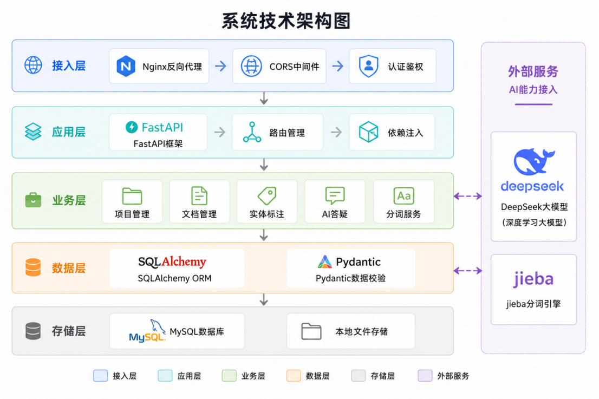

### 1.4 团队分工

本项目由三位成员协作完成，整体分工明确，同时在关键阶段保持联动推进。
`朱孔峥`主要负责后端方向，完成了后端整体架构设计、核心业务 API 开发，以及数据库模型定义与 ORM 映射配置，覆盖了用户、项目、文档、标注等核心实体；同时负责编写多模块后端测试文件，参与 CI/CD 建设，并对 LLM 服务、用户认证、项目与文档接口、标注接口和 AI 接口进行了安全审查与高风险问题修复。

`周芷伊`主要负责前端方向，完成了前端整体架构设计与页面实现，围绕登录注册、项目管理、文档管理、编辑器等核心界面进行了开发，同时补充了前端测试命令和测试用例，并针对 XSS 风险落实了 DOMPurify 等前端安全处理方案。

`张贤文`主要负责 API 设计、系统联调和 AI 集成工作。在项目初期，他参与了数据库架构设计与后端基础能力建设；在接口设计阶段完成 OpenAPI YAML 规范文件编写；在联调阶段推动前端页面从本地假数据切换到真实后端接口；在 AI 阶段完成 DeepSeek 大语言模型接入，并推进古文智能解析模块落地。同时，他还参与了前端编辑器布局优化、后端 pytest 测试完善，以及 GitHub Actions、Codecov 等持续集成能力的配置与接入。整体来看，团队采取的是“前后端分工明确、联调阶段集中协作、工程化能力共同补齐”的协作方式。

## 二、版本控制与团队协作\[朱孔峥、周芷伊、张贤文]

### 2.1 分支策略

本项目采用以 `main`、`develop` 和个人功能分支为核心的 Git 分支策略。`main` 分支用于保存阶段性稳定版本，对应可以展示、验收和部署的版本内容；`develop` 分支作为日常集成分支，承接前后端联调、接口适配、测试修复和功能合并；每位成员则在自己的个人分支或功能分支上开展具体开发工作，例如围绕前端页面、后端接口、AI 集成、测试与 CI 配置分别推进。这样的分层做法可以避免所有改动直接进入主分支，也降低了多人同时开发时互相影响的风险。

具体协作流程上，成员通常先在个人分支完成一个相对独立的功能模块，经过本地自测后再发起合并请求，将代码合入 `develop` 进行统一联调；当 `develop` 分支上的主要功能完成、测试通过且版本相对稳定后，再合并到 `main`。对课程项目而言，这种流程既保留了工程化开发的基本规范，也兼顾了团队规模较小、开发节奏较快的实际情况。
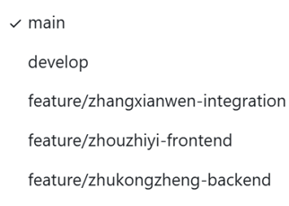

### 2.2 提交规范

为了减少协作过程中的理解成本，项目在提交时尽量使用语义清晰的提交说明，优先让提交信息能够直接反映本次改动的类型与目标。常见的提交前缀包括 `feat`、`fix`、`refactor`、`test`、`docs`、`chore` 等，例如新增接口、修复登录问题、补充测试、调整页面布局时，都分别采用对应的说明方式。这样做的意义在于，当团队成员需要回看某次修改的上下文时，可以较快定位出是功能开发、缺陷修复还是工程配置调整。

在日常提交习惯上，我们也尽量避免一次提交混杂过多无关内容，而是将接口开发、页面样式调整、测试补充、CI 配置等内容分开提交。配合 Pull Request 审查与分支合并流程，提交记录不仅服务于版本回溯，也成为团队内部沟通的一部分。
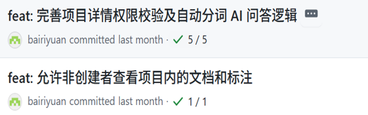
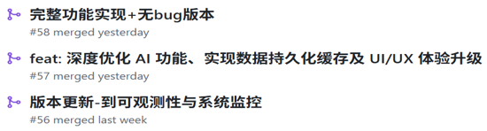

### 2.3 协作统计

从协作过程来看，团队开发大致经历了“架构与接口设计、前后端并行开发、系统联调与优化、测试与安全补齐”几个阶段。前期由后端先完成基础数据模型、接口框架和 OpenAPI 规范，前端同步推进页面设计与原型制作；中期通过 `develop` 分支集中完成真实接口接入、编辑器页面改造和 AI 功能整合；后期则把重点放在测试、CI/CD 和安全审查上，逐步将课程项目从“能运行”推进到“能稳定协作和交付”的状态。

团队协作并不只是代码分工，还体现在文档、测试和质量控制的同步推进上。README 中接入了 CI 与 Codecov 状态徽章，GitHub Actions 会在推送到 `main`、`develop` 或发起 PR 时自动执行前后端检查，这使得版本控制不再只是“存代码”，而是逐步成为项目质量管理的基础设施。


## 三、UI/UX 设计与原型\[周芷伊]

### 3.1 用户画像与场景分析

本项目的主要用户可以概括为三类。
第一类是古汉语课程中的学生，他们希望在阅读古文时获得更直观的分词、释义和实体标注辅助，从而降低理解门槛；第二类是授课教师或助教，他们更关注材料管理、课堂演示和作业批改辅助，希望能把多篇文本按项目组织起来并进行统一展示；
第三类是对古籍整理或数字人文感兴趣的研究者，他们需要更加结构化的文本处理结果，用于后续的统计分析、专题整理和研究积累。

围绕这些用户，我们把平台的使用场景归纳为“按项目组织文本资料”“围绕单篇古文进行细读标注”“在阅读过程中随时获取智能解释”三种典型情境。也正因为如此，前端设计没有采用过于复杂的专业工具式界面，而是希望在教学场景和研究场景之间取得平衡，让初次使用的用户也能较快理解页面结构与操作路径。

### 3.2 界面原型设计

本项目的界面原型主要使用 `Figma` 完成，先从信息结构和页面流转关系入手，再逐步细化到具体页面。原型设计覆盖了首页、登录注册页、项目管理页、文档列表页、标注编辑页、自动分词页和古文解析页等核心页面，整体风格强调古典感与可读性的结合，在色彩上以绿色、米色和金色作为主辅配色，以呼应古文主题，又避免界面过于沉闷。

在原型阶段，页面不仅关注“长什么样”，还重点考虑了功能如何被自然地看见和使用。例如，项目与文档的层级关系需要清楚，编辑器区域和智能侧边栏需要并置展示，用户在阅读原文时不能频繁跳页才能完成标注或提问。因此，Figma 原型的作用不仅是出图，更是帮助我们提前验证页面组织方式是否顺手。

#### 3.2.1 交互设计原则

交互设计上，前端重点遵循了“路径尽量短、反馈要及时、重点信息可直接观察”这几个原则。用户进入系统后，能够较快完成从项目列表到文档列表，再到编辑器页面的跳转；进入编辑器后，实体标注、古文解析、自动分词等功能通过标签切换集中在同一工作区内，减少了功能分散带来的认知负担。对于保存、删除、加载、错误等操作，页面都尽量给出明显的状态反馈，避免用户对当前操作是否生效产生疑问。

另外，考虑到古文处理本身就带有较强的阅读属性，交互设计中特别强调“原文可见”。无论是高亮标注、词块分词，还是字词释义提示，都尽量围绕正文本身展开，而不是把结果完全挪到独立页面中展示，这样可以让用户在阅读和分析之间保持连贯。

#### 3.2.2 用户体验设计

在用户体验层面，页面样式和组件设计尽量保持统一，按钮、卡片、输入框、弹窗、标签等基础组件采用较一致的风格，减少页面之间的割裂感。针对空数据、请求失败、加载中等边界场景，前端也补充了相应提示，避免页面只在“理想状态”下可用。对于智能问答返回的内容，前端使用安全的富文本渲染方式进行处理，在保证可读性的同时兼顾安全性。

从实现过程看，Figma 设计对前端编码阶段帮助很大。一方面，它让页面布局、配色和组件样式有了较明确的参照；另一方面，也帮助我们在开发前就提前发现了一些不合理的布局关系，减少了后期反复修改的成本。

## 四、软件架构设计\[朱孔峥]

### 4.1 整体架构

### 4.2 技术架构分层

#### 4.2.1 表现层（前端）

#### 4.2.2 业务逻辑层（后端）

#### 4.2.3 数据访问层

### 4.3 关键设计决策

## 五、API 设计 \[朱孔峥、张贤文]

### 5.1 设计原则

本项目的 API 设计遵循 RESTful 风格，力求接口语义清晰、结构统一。所有接口均以 `/api` 为前缀，资源路径采用复数名词（如 `/users`、`/projects`、`/documents`），并通过 HTTP 动词（GET、POST、PUT、PATCH、DELETE）来表达对资源的操作意图。

为了降低前后端联调成本，系统定义了统一的 JSON 响应结构。其中 `code` 为业务状态码（0 表示成功），`message` 用于传递提示信息，`data` 承载实际的业务数据。这种设计使得前端可以编写统一的拦截器来处理请求结果和异常，避免了在各个页面中重复编写错误处理逻辑。

### 5.2 接口文档

项目接口主要围绕四个核心实体展开，详细的 OpenAPI 规范已在 `docs/AncientChinese API.openapi.yaml` 中定义。

#### 5.2.1 用户认证接口
用户模块负责账号管理与身份认证。系统提供了用于新用户注册的接口，以及对应的增删改查接口用于用户信息维护。在登录认证方面，接口接收用户名和密码，验证成功后会在返回数据中包含用户 ID 和 JWT Token，供后续请求鉴权使用。

#### 5.2.2 项目管理接口
项目是组织文档的顶层容器。前端可以通过接口获取项目列表（支持按所有者过滤），也可以获取单个项目的详细信息。同时，系统支持通过标准的 HTTP 动词对项目进行创建、更新和删除等生命周期管理操作。

#### 5.2.3 文档管理接口
文档接口设计体现了与项目的层级关系。用户可以获取和创建特定项目下的文档，也可以通过全局搜索接口按关键字查找文档。此外，系统也提供了针对单个文档的详情获取、完整或部分更新以及删除接口。

#### 5.2.4 标注接口
标注接口同样体现了与文档的从属关系。系统允许获取某篇文档的所有实体标注，并支持新增包含实体内容、类型、起止位置等信息的标注。为了方便管理，接口还支持按项目、文档或实体类型全局检索标注，并提供针对单条标注的更新与删除能力。

### 5.3 接口安全设计

在接口安全方面，项目结合 OWASP Top 10 视角进行了专门的安全审查与加固。首先是身份鉴权，除登录和注册接口外，所有业务接口（项目、文档、标注、AI）均要求在请求头中携带有效的 JWT Token，防止未授权访问。其次是敏感信息保护，数据库中用户密码采用 `bcrypt` 算法进行哈希加盐存储，绝不保存明文，并且在返回用户信息时严格剔除密码哈希字段，防止敏感数据泄露。

此外，JWT 签名密钥和第三方大模型 API 密钥均从环境变量中读取，移除了代码中的硬编码默认值，并在启动时进行强制检查。在防注入与异常处理方面，后端采用 SQLAlchemy ORM 进行数据库操作，天然防御 SQL 注入；同时对接口异常进行了统一捕获，避免向前端暴露数据库结构或内部堆栈细节。

### 5.4 接口测试

接口测试是保障后端质量的关键环节。项目使用 `pytest` 框架对所有核心 API 进行了自动化测试覆盖。测试范围不仅包含了用户、项目、文档、标注的增删改查正常流程，还覆盖了登录失败、缺少必填字段、无鉴权访问等异常边界情况。

为了保证测试的稳定性和独立性，测试环境使用 SQLite 内存数据库替代真实的 MySQL 数据库，避免了脏数据干扰。同时，接口测试已集成到 GitHub Actions 工作流中，每次代码提交或合并请求都会自动触发测试并生成覆盖率报告，确保接口逻辑的持续正确性。

## 六、前端实现 \[周芷伊]

### 6.1 技术栈与开发环境

前端部分采用 Web 方案实现，使用 Vue 3、Vite 与 TypeScript 作为主要技术栈。Vue 3 负责页面组件组织与响应式状态管理，Vite 提供轻量的开发与构建能力，TypeScript 则帮助我们在接口对接、数据结构定义和组件开发过程中减少低级类型错误。路由层使用 Vue Router 管理页面跳转，状态层使用 Pinia 维护部分前端状态，接口通信由统一封装的 HTTP 客户端完成，请求过程中会自动处理查询参数、业务响应解包和 token 注入等通用逻辑。

开发环境方面，前端通过 Node.js 管理依赖，使用 `npm` 进行本地开发、构建和测试。项目同时配置了 ESLint、Prettier、Oxlint 与 Vitest，既方便开发阶段尽早发现问题，也使前端代码能够顺利接入 CI 环境。整体来看，前端方案兼顾了课程项目的开发效率与后续维护可扩展性。

### 6.2 核心功能模块实现

#### 6.2.1 项目与文档管理模块

本小节对应的是项目与文档管理模块。前端围绕“项目 - 文档”这一层级关系组织页面结构，用户可以先浏览项目列表，再进入项目下的文档列表，对文档进行查看、创建、编辑和删除等操作。为了让接口调用更清晰，前端将项目、文档、用户、标注、AI 等请求分别封装到独立的 API 文件中，页面只关心业务本身，不直接处理重复的请求细节。
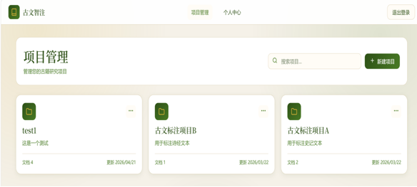
在这一部分实现中，除了基本的增删改查流程，前端还特别处理了加载状态、错误提示与空数据场景。例如当项目下暂时没有文档时，页面会显示空状态提示，而不是直接出现空白界面；当删除或获取文档失败时，也会向用户反馈明确的信息。这些处理虽然不属于“亮眼功能”，但它们直接决定了系统是否真正可用。

#### 6.2.2 数据统计模块

数据统计模块主要围绕项目维度展开，用来帮助用户快速了解当前项目的整理进度和标注情况。在项目管理页面中，前端会结合后端返回的数据展示项目下的文档数量、标注总量以及不同实体类型的分布情况，并通过统计弹窗进行集中呈现。相比单纯显示一串数字，这种做法更适合教学展示和阶段性汇报，也让用户能更直观地看到项目处理成果。
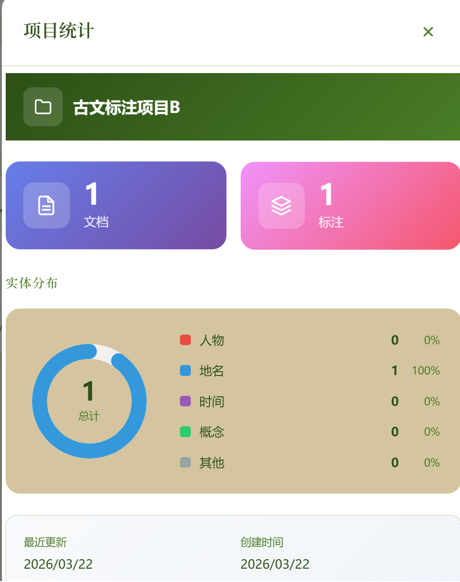
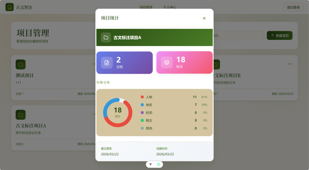
在实现形式上，前端通过统计卡片、环形图和图例等方式展示人物、地名、时间、概念等实体的占比情况，同时补充最近更新时间和创建时间等辅助信息。这样一来，统计模块既承担了“汇总信息”的作用，也增强了项目管理页面的信息密度，使系统不只是管理文本，还能反馈文本处理结果。

#### 6.2.3 智能回答模块

智能回答模块是平台中与大语言模型结合最紧密的功能之一，主要服务于用户在阅读古文过程中的即时提问需求。用户无需离开当前文档页面，就可以直接围绕正文内容提出问题，例如请求翻译成现代汉语、解释重点词语、分析句子含义等。前端将问答区域与编辑器页面整合到同一工作区中，使“阅读”和“提问”能够在同一上下文内连续完成。
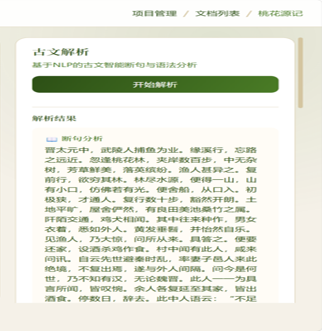
从交互层面看，系统不仅支持自由输入问题，也提供了若干快速提问选项，降低初次使用的操作门槛。为了提高阅读体验，AI 返回内容在前端会经过格式化与安全净化处理，既保留较好的可读性，也避免因直接渲染原始内容而产生安全风险。这个模块让平台从传统的标注工具进一步扩展为能够辅助理解古文内容的学习工具。

#### 6.2.4 实体标注模块

实体标注模块是整个平台最核心的交互模块之一，承担了正文阅读、文本编辑、实体高亮、标注新增与删除等多项操作。为了提高使用效率，页面将正文展示区和侧边功能区并列放置，用户可以一边查看古文原文，一边在右侧完成实体类型选择、匹配位置确认和标注管理。标注结果会直接以高亮形式映射回正文区域，减少了“数据在列表里、文本在另一边”的割裂感。
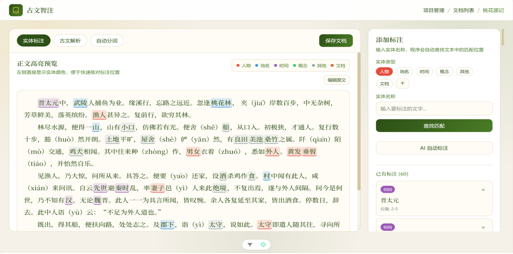
在实现细节上，前端支持根据输入实体内容自动查找文本中的匹配位置，并允许逐条确认或批量添加，从而降低重复标注的成本。同时，已有标注会按位置排序显示，方便用户回看与校对。围绕这个模块，前端还对编辑器布局做了进一步优化，使古文解析、自动分词和问答功能能够在同一页面中平稳切换，增强整体操作连贯性。

#### 6.2.5 自动分词模块

自动分词模块用于帮助用户对古文文本进行初步切分，并给出相应的词性信息，降低逐字阅读时的理解负担。对于古汉语文本来说，断词本身就是理解的重要一步，因此这一功能不仅是技术展示，也是面向学习和研究场景的实际辅助工具。前端将分词结果直接嵌入阅读区域展示，用户可以在查看原文的同时看到切分后的词块，而不需要跳转到其他页面进行比对。
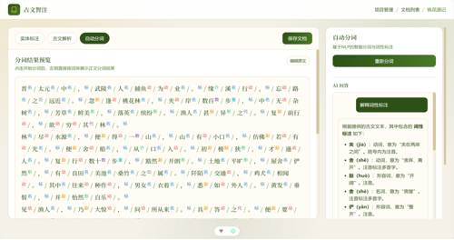
为了保证使用连贯性，自动分词模块也被纳入统一的编辑器工作区中，与实体标注和古文解析并列切换。分词完成后，前端会按词块和词性标签的形式展示结果，并保留进一步提问的入口，使用户不仅能看到“怎么切”，也能继续追问“为什么这么切”，从而提升该功能在教学场景中的解释性。

#### 6.2.6 古文解析模块

古文解析模块主要承担对整段文本进行语义解释和阅读辅助的任务。与实体标注关注局部信息不同，古文解析更强调对整篇文本的整体理解，包括全文译文、重点词语解释以及部分语法提示等内容。前端在展示这一模块时，没有把解析结果简单堆叠成说明文字，而是尽量保持与原文之间的对应关系，使用户能够一边阅读古文，一边查看字词释义和整段解释。
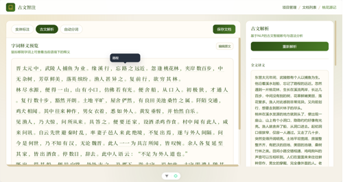
从页面呈现来看，古文解析模块采用了“左侧原文预览、右侧结果与问答补充”的方式，使全文理解、细节解释和继续追问能够自然衔接。这样设计的目的，是让解析功能不仅停留在一次性输出结果，而是成为贯穿阅读过程的辅助能力，更符合古文学习和教学演示的实际使用方式。

### 6.3 性能优化实践

前端性能优化主要集中在几个方面。首先，页面路由采用`按需加载`方式，登录页、项目页、文档页、编辑器页等视图在需要访问时再加载，减少了首屏一次性打包过多内容的问题。其次，接口层统一处理查询参数拼接、成功响应解包和错误抛出逻辑，避免不同页面重复书写不一致的请求代码，也降低了无效请求和边界错误的出现频率。

此外，编辑器页面中与标注、解析、分词相关的展示结果大多通过计算属性派生，前端尽量把展示逻辑和基础数据分离，减少不必要的重复计算。对于一些可能较长的 AI 问答或侧边栏内容，页面也采用局部滚动与自动滚动到底部的方式，保证功能丰富的同时不至于让界面变得卡顿或混乱。

### 6.4 兼容性处理

兼容性方面，前端主要面向现代浏览器环境进行开发，并结合响应式布局处理不同宽度下的显示问题。在较大屏幕下，页面采用左右分栏的工作区布局，以保证编辑器和侧边智能面板能够同时展示；在较窄屏幕下，则通过布局折叠和顺序调整，保证核心操作仍然可以完成。这样的处理方式使页面既适合电脑端演示，也能在较小窗口下维持基本可用性。

安全兼容性同样是前端实现的一部分。针对用户输入和 AI 返回内容，页面尽量避免直接使用不安全的 DOM 注入方式，对于需要以富文本展示的内容则使用 `DOMPurify` 进行净化处理。再加上统一的接口封装、错误处理和 token 注入机制，前端在和真实后端对接时能够保持较稳定的行为表现。

## 七、后端实现 \[朱孔峥]

### 7.1 技术栈与架构

### 7.2 核心业务模块实现

#### 7.2.1 用户认证与授权

#### 7.2.2 课程管理服务

#### 7.2.3 点名业务逻辑

#### 7.2.4 数据统计分析

### 7.3 数据库设计

结合 ER 图对数据库进行详细描述：有哪些表，保存了哪些数据，为什么这么设计，索引策略是什么。

### 7.4 中间件与工具集成

#### 7.4.1 缓存机制（Redis / 本地缓存）

#### 7.4.2 日志系统（结构化日志）

#### 7.4.3 其他中间件（如适用）

### 7.5 性能优化实践

描述后端做了哪些性能优化（N+1 查询消除、索引优化、Redis 缓存、游标分页等），提供 Before / After 耗时数据。

## 八、AI 工程化应用 \[张贤文]

### 8.1 AI 辅助开发实践

在本项目开发周期中，AI 工具深度参与了从架构设计到代码落地的各个环节。项目初期，团队通过编写 AI 辅助开发规则文档，明确了使用大模型辅助编程的场景边界、代码提交规范及敏感信息保护原则，确保 AI 生成代码与现有架构规范保持一致。在编码实践中，AI 被广泛用于辅助生成 FastAPI 后端基础 CRUD 接口模板、SQLAlchemy 数据库模型映射及 OpenAPI YAML 规范文件，从而使团队能够将更多精力聚焦于古文解析等核心业务逻辑的设计。在测试阶段，借助 AI 快速构建了针对用户、项目、文档和标注等核心模块的 pytest 测试框架，并自动生成了大量边界测试数据，加速了测试覆盖率的提升。此外，在配置 GitHub Actions 持续集成和 Codecov 覆盖率上传的 CI/CD 流程时，AI 提供的 YAML 脚本优化建议也帮助团队快速拉通了自动化代码质量检查链路。

### 8.2 AI 辅助故障排查

在系统联调与测试阶段，AI 工具在故障排查（Vibe Debugging）方面发挥了重要作用。例如，在后端本地启动验证初期，针对频繁出现的跨域（CORS）拦截及核心依赖缺失报错，通过向 AI 输入完整错误堆栈和环境配置，迅速获取了 FastAPI 中间件的正确配置方案，顺利打通了前后端本地联调链路。在后端自动化测试阶段，使用 SQLite 内存数据库进行测试隔离时，多连接环境下曾频繁出现“表丢失”或“数据不一致”现象。面对此类并发状态问题，借助 AI 深入分析 SQLAlchemy 会话生命周期，最终采纳了 StaticPool 连接池复用方案，并在测试会话结束时强制释放资源，有效解决了测试用例执行不稳定的问题。此外，针对 Codecov 徽章因目标分支无数据而无法显示的问题，也在 AI 引导下通过排查 GitHub Actions 触发机制得以解决。

### 8.3 AI 功能集成

作为本项目的核心能力，AI 赋能模块的深度集成使平台从基础的 CRUD 应用升级为具备自然语言理解能力的智能化工具。在技术实现上，后端封装了专属大模型服务模块，深度接入 DeepSeek API，并针对古汉语特性设计了优化的系统提示词（System Prompt），实现了对古文文本的精准断句、语法分析及现代文翻译。为提升标注效率，系统开发了基于大模型的 AI 自动标注功能，能够以较高召回率自动提取人名、地名、时间及核心概念等实体信息，并支持前端一键批量入库。在分词功能方面，考虑到大模型接口可能存在的网络延迟或限流风险，系统设计了“DeepSeek 优先 + 本地 Jieba 降级”的双引擎分词机制，在 AI 响应超时时自动切换至本地 Jieba 引擎，保障了服务的高可用性。此外，前端编辑器中集成了智能对话助手，通过引入 Markdown 渲染适配、自动滚屏及上下文感知问答逻辑，使用户在阅读和标注古文时能够随时向 AI 提问，优化了长篇古籍处理的交互体验。

## 九、安全设计 \[朱孔峥]

### 9.1 安全威胁分析

分析系统面临的主要安全威胁（OWASP Top 10 相关），如 SQL 注入、XSS、越权访问等。

### 9.2 安全防护措施

#### 9.2.1 身份认证与授权

描述使用的认证方案（JWT / OAuth 等）及其配置。

#### 9.2.2 输入验证与 SQL 注入防护

描述如何对用户输入进行校验，是否使用参数化查询 / ORM。

#### 9.2.3 敏感数据保护

描述敏感数据（密码、个人信息）的存储和传输方式（哈希、HTTPS 等）。

#### 9.2.4 其他安全措施

速率限制、CSRF 防护、安全 HTTP 头等。

### 9.3 安全审计

是否使用工具（如 `npm audit`、`bandit`、Snyk）进行过依赖安全扫描，结果如何。

## 十、软件测试 \[张贤文、朱孔峥、周芷伊]

### 10.1 测试策略

本项目的测试策略强调“核心链路优先、前后端分别验证、持续集成自动执行”。考虑到课程项目时间有限，我们没有一开始就追求非常复杂的测试体系，而是优先覆盖真正影响系统可用性的关键功能，包括用户登录、项目管理、文档管理、标注操作、AI 相关接口以及前端的 API 封装、路由与基础状态逻辑。后端使用 pytest 组织测试，前端使用 Vitest 进行测试，在此基础上再通过 GitHub Actions 将测试流程纳入日常开发。

从分层角度看，后端测试主要覆盖接口行为和部分服务逻辑，重点验证请求参数、权限控制、资源增删改查、异常路径和导入导出等场景；前端测试则更关注接口请求封装是否正确、路由跳转是否符合预期、状态管理和边界响应是否稳定。这样的分工让测试既贴合项目实际，也能在多人协作中尽早暴露问题。

### 10.2 单元测试

后端单元测试与接口测试主要集中在 `backend/tests` 目录下，已经覆盖用户、项目、文档、标注以及服务层等核心模块。测试内容不仅包含正常创建、查询、修改、删除流程，也包含登录失败、重复用户名、缺少必填字段、资源不存在、无鉴权访问等边界与异常情况。为了保证 CI 环境的稳定性，后端测试中使用了替代真实数据库的测试依赖，使测试运行不依赖线上或本地 MySQL 服务。

前端单元测试主要位于 `frontend/src/__tests__` 目录中，覆盖了 `api`、`router` 和 `stores` 等模块。以文档接口测试为例，测试会检查请求方法、路径、查询参数、返回值解包以及异常抛出是否符合封装预期；路由测试则验证页面导航与路由配置是否正常；状态层测试用于保证基础数据逻辑不会因后续修改而失效。虽然前端测试并没有把每一个页面细节都写成自动化用例，但对关键公共逻辑已经形成了有效保护。

### 10.3 集成测试

集成测试主要体现在两个层面。
第一层是后端接口层面的集成验证，即通过测试客户端完整走通从请求进入、参数校验、业务执行到响应返回的链路，确保接口不是“单个函数能跑”，而是整个调用流程都能正确工作。文档导入、导出、分页查询、标注增删改查等功能都在这类测试中得到了覆盖。

第二层是前后端联调阶段的真实接口适配。项目在开发早期曾经使用本地假数据驱动部分页面，进入联调阶段后，前端逐步改造为真实接口调用，并围绕项目列表、文档列表、编辑器、AI 功能等核心页面完成了与后端 API 的对接验证。这一阶段虽然并不完全依赖自动化脚本，但它对项目最终可交付性非常关键，也正是在这个阶段，许多请求格式、字段命名和错误处理问题被及时发现并修正。

### 10.5 测试结果汇总

| 测试类型  | 用例数                      | 通过率                     | 覆盖率            |
| ----- | ------------------------ | ----------------------- | -------------- |
| 单元测试  | 后端 5 个核心测试文件，前端 11 组测试文件 | 以 CI 自动执行结果为准，当前流程可稳定运行 | 以 Codecov 报告为准 |
| 集成测试  | 覆盖接口链路与前后端联调核心场景         | 以联调结果与 CI 结果为准          | 以 Codecov 报告为准 |
| 端到端测试 | 当前阶段未单独引入自动化框架           | 以人工走查结果为准               | 不适用            |

## 十一、持续集成与持续交付（CI/CD） \[朱孔峥、张贤文]

### 11.1 CI/CD 方案

本项目采用 GitHub Actions 作为核心的持续集成与持续交付（CI/CD）工具。通过在代码仓库中配置自动化工作流，我们将代码检查、自动化测试和覆盖率统计等环节固化为标准流程。这种“自动化质量门禁”的引入，使得团队在多人协作开发时，能够尽早发现代码风格问题和潜在的逻辑缺陷，从而有效减少合并冲突和返工成本。

### 11.2 自动化流水线

项目的自动化流水线定义在 `.github/workflows/ci.yml` 文件中，主要包含前端（frontend）和后端（backend）两个并行运行的 Job。

在后端流水线中，首先会配置 Python 3.12 环境并安装依赖，随后使用 `ruff` 进行代码风格和规范检查（Lint），最后运行 `pytest` 执行单元测试与接口测试，并生成 XML 格式的覆盖率报告。为了保证 CI 环境的独立性，后端测试通过环境变量注入和依赖覆盖，使用 SQLite 内存数据库替代了真实的 MySQL 数据库。

在前端流水线中，配置了 Node.js 20 环境，使用 `eslint` 进行严格的代码规范检查（设置 `--max-warnings=0`），随后运行 `vitest` 执行前端测试并生成 `lcov.info` 覆盖率文件。

流水线的最后阶段，前后端生成的覆盖率报告会被分别上传至 Codecov 平台，并通过设置不同的 flag（`backend` 和 `frontend`）进行独立展示。同时，项目的 README 顶部也接入了 CI 状态和 Codecov 覆盖率徽章，直观反映当前 `develop` 分支的健康状况。

### 11.3 分支保护与质量门禁

为了保障主干代码的稳定性，项目在分支合并策略上设置了严格的质量门禁。CI 流水线被配置为在代码推送到 `main` 和 `develop` 分支，以及发起 Pull Request（PR）时自动触发。

在合并规则上，团队要求所有合入 `develop` 和 `main` 分支的 PR 必须通过 CI 流水线的全部检查，包括前后端的 Lint 检查和自动化测试。如果流水线失败（例如存在 ESLint 报错或 pytest 用例未通过），则不允许进行合并操作。此外，通过 PR Review 机制，团队成员可以对代码逻辑和工作流配置进行交叉审查，进一步提升了代码交付的质量。

## 十二、系统部署 \[张贤文]

### 12.1 部署架构

本项目采用前后端分离的容器化部署架构，以确保开发、测试与生产环境的高度一致性。整体部署方案基于 Docker 引擎，通过 Docker Compose 进行多容器编排。架构中包含三个核心服务节点：前端服务（基于 Node.js 与 Vite 构建，提供静态资源与页面路由）、后端服务（基于 Python 与 FastAPI 构建，处理核心业务逻辑与 AI 模型调度）以及数据库服务（支持灵活切换远程阿里云 MySQL 或本地 Docker 内部 MySQL）。在网络层面，前端容器与后端容器通过 Docker 内部网络进行通信，同时将前端的 5173 端口和后端的 8080 端口映射至宿主机，以便外部访问。这种架构设计不仅实现了服务的解耦，还通过挂载本地目录（Volumes）实现了开发阶段的代码热重载，极大提升了调试效率。

### 12.2 容器化

系统的容器化方案主要通过编写多阶段的 `Dockerfile` 和统一的 `compose.yaml` 文件来实现。前端镜像基于轻量级的 Node.js 基础镜像，在构建阶段完成依赖安装与代码打包，随后通过开发服务器或 Nginx 提供服务；后端镜像基于 Python 3.12 基础镜像，通过 `requirements.txt` 安装 FastAPI、SQLAlchemy 及 Jieba 等核心依赖，并配置 Uvicorn 作为 ASGI 服务器。在容器编排方面，项目提供了两套 Docker Compose 配置：`compose.yaml` 用于日常开发，配置了代码目录挂载以支持热重载；`compose.prod.yaml` 则用于模拟生产环境，增加了 CPU 与内存的资源限制，并将前端端口优化映射至 80 端口，确保系统在资源受限环境下的稳定运行。

### 12.3 部署步骤

为了保证部署过程的完全可复现，系统提供了一套标准化的快速部署流程。首先，部署人员需确保宿主机已安装 Docker Desktop 或 Docker Engine，并准备好包含 `DEEPSEEK_API_KEY` 的环境配置文件。随后，在项目根目录下执行 `docker compose up -d` 命令，Docker Compose 将自动拉取基础镜像、构建前后端服务镜像，并在后台按依赖顺序启动所有容器。部署完成后，可通过访问 `http://localhost:5173` 进入前端界面，或访问 `http://localhost:8080/health` 检查后端 API 的健康状态。若需排查启动错误或数据库连接问题，可通过 `docker compose logs -f backend` 实时查看后端日志。当需要清理环境时，执行 `docker compose down` 即可安全停止并移除所有相关容器与网络。

### 12.4 环境配置

项目采用 `.env` 文件集中管理环境变量，以实现开发与生产环境的有效隔离。在项目根目录提供的 `.env.example` 模板中，定义了包括数据库连接信息（Host、Port、User、Password、Name）以及第三方服务密钥（如 DeepSeek API Key）在内的核心配置项。在实际部署时，系统支持两种数据库连接场景：场景 A（默认）配置为连接远程阿里云数据库，适用于团队协作与数据共享；场景 B 则配置为连接 Docker 内部的 `db` 容器，适用于完全隔离的本地测试。通过这种环境变量注入机制，前后端代码无需硬编码任何敏感信息或环境差异参数，确保了代码库的安全性与跨环境迁移的灵活性。

## 十三、可观测性与监控 \[张贤文]

### 13.1 错误追踪

描述接入的错误追踪工具（Sentry 等），包括：

- 接入方式
- 捕获了哪些类型的错误
- 是否配置了告警

### 13.2 日志管理

描述日志方案：使用了结构化日志（Pino / Winston / Loguru 等），日志级别如何配置，如何查看运行日志。

### 13.3 健康检查与可用性监控

描述 `/health` 接口的实现，以及是否接入了 Uptime 监控工具（UptimeRobot / Better Stack 等）。

### 13.4 指标监控（如适用）

如果接入了 Prometheus / Grafana Cloud 等自定义指标，描述监控了哪些关键指标。

| <br /> | <br /> | <br /> | <br /> |
| ------ | ------ | ------ | ------ |
| <br /> | <br /> | <br /> | <br /> |

## 十四、功能展示 \[张贤文、周芷伊、朱孔峥]

### 14.1 系统演示

视频 <video controls src="./8d1c5dd1fc587c2da91e1bcece29d488.mp4" title="Title"></video>

### 14.2 性能测试结果

为了验证系统在并发访问下的稳定性和响应能力，本项目引入了 **Locust** 进行性能测试。测试主要针对后端的关键接口（如健康检查、指标收集、项目列表等）进行并发模拟。

#### 测试环境与工具
- **测试工具**: Locust (Python 性能测试框架)
- **测试脚本**: `backend/locustfile.py`
- **测试指标**: 响应时间 (Response Time)、每秒请求数 (RPS)、错误率 (Error Rate)

#### 测试场景
模拟多个虚拟用户并发访问系统，用户行为包括：
1. 访问 `/health` 接口检查系统状态。
2. 访问 `/metrics` 接口获取系统指标。
3. 访问 `/api/projects` 接口模拟业务请求。

#### 测试结果截图
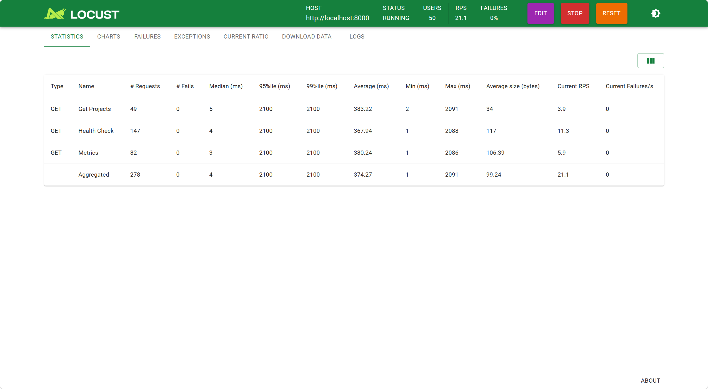
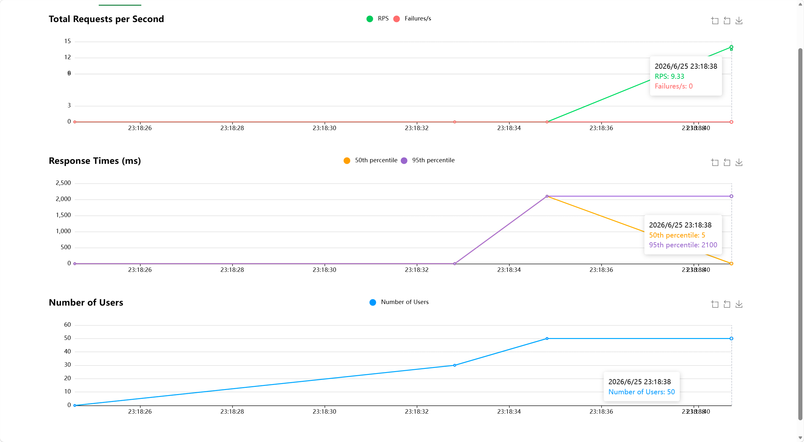

**测试结论**:
在模拟并发用户的压力下，系统核心接口响应迅速，错误率保持在 0%，证明 FastAPI 后端架构能够良好地应对正常负载，系统具备较好的并发处理能力。

## 十五、总结与展望 \[朱孔峥、张贤文、周芷伊]

### 15.1 项目总结

从整体完成情况来看，本项目已经实现了一个较完整的古文智能标注平台原型，并顺利打通了从用户登录、项目建立、文档管理到实体标注、自动分词、古文解析与智能问答的核心流程。项目不再只是若干彼此独立的页面或接口，而是形成了一套能够支撑古汉语文本研究与教学场景的基础系统。前端负责提供较清晰的操作入口和可视化展示，后端负责业务逻辑、数据存储与接口支撑，AI 模块则进一步提升了系统在古文理解和辅助分析方面的实用价值。

对团队而言，这个项目最大的成果并不只是“功能做出来了”，而是在有限周期内把需求、设计、开发、联调、测试、CI 和安全审查串成了一条完整的工程链路。它让我们对一个软件项目从想法走向可交付版本的过程有了更具体的认识。

### 15.2 技术收获

通过本次项目实践，团队成员在各自方向上都获得了比较直接的提升。前端方面，成员不仅完成了页面开发，也真正经历了从 Figma 原型到组件化实现、从本地假数据到真实接口调用、从视觉设计到安全处理的完整过程；后端方面，成员在 FastAPI 架构设计、数据库建模、接口规范、测试编写与安全修复方面积累了更系统的经验；联调与 AI 方向则让团队对 OpenAPI、真实接口适配、大模型接入和持续集成有了更工程化的理解。

相比单独完成某一个实验功能，这次项目更重要的收获是让我们理解了“协作开发”本身。很多问题并不是单点技术难，而是需要前后端、接口文档、测试和部署意识一起配合，只有链路完整，项目才能真正稳定。

### 15.3 问题与反思

项目推进过程中也暴露出一些典型问题。首先是前后端在开发初期对字段命名、响应结构和错误处理方式的理解并不完全一致，导致联调阶段需要反复对齐；其次是 AI 功能虽然提升了系统亮点，但它也带来了响应时间、异常处理和内容展示方式上的新要求；再者，安全与测试这类工作如果放得太靠后，往往会在收尾阶段集中暴露压力。好在团队后期及时补上了鉴权、密钥管理、密码哈希保护、测试与 CI 等内容，使系统质量得到明显改善。

回头看，这些问题也提醒我们，课程项目即使规模不大，也应尽早建立统一的数据约定、接口规范和基础质量门槛。越早把文档、测试、分支策略和安全考虑纳入开发流程，后期返工成本就越低。

### 15.4 未来展望

如果项目后续继续推进，下一步可以从三个方向展开。第一是继续提升智能能力，例如在古文解析中引入更细粒度的断句、词法解释、句式识别和多轮上下文问答，让 AI 功能不止停留在“能回答”，而是逐步接近“能辅助研究”。第二是继续完善协作与数据能力，例如增加更细致的标注规范管理、角色权限控制、标注结果统计分析和批量导入导出支持，使平台更适合实际课程和课题场景。第三是继续补强工程化部分，包括更完整的端到端测试、部署监控、依赖安全治理和性能优化，为系统从课程项目走向长期维护奠定基础。

总的来说，本项目已经完成了从零到一的搭建，后续仍有较大的扩展空间。无论是面向教学辅助还是数字人文研究，这类把古文文本处理与智能分析结合起来的平台，都具有继续打磨和深化的价值。

## AI 使用声明

本文档中以下部分由 AI 辅助生成，经人工审核和修改：

| 章节         | AI 工具       | 使用方式          | 人工修改情况                          |
| ---------- | ----------- | ------------- | ------------------------------- |
| 第三部分 UI 设计 | figma自带AI工具 | 用于初步生成页面设计和风格 | 已结合项目实际功能修改                     |
| 第五部分 API 设计 | Trae (Gemini-3.1-Pro-Preview) | 用于根据项目文档生成 API 设计说明 | 已按当前项目实际功能、代码结构和安全设计人工修订 |
| 第六部分前端实现   | cursor      | 用于初步生成大致框架    | 已按当前项目实际功能、代码结构、依赖配置和 CI 流程人工修订 |
| 第十一部分 CI/CD | Trae (Gemini-3.1-Pro-Preview) | 用于根据项目文档生成 CI/CD 说明 | 已按当前项目实际功能、代码结构和 CI 流程人工修订 |
| 第十五部分 性能测试 | Trae (Gemini-3.1-Pro-Preview) | 用于生成 Locust 性能测试脚本及文档说明 | 已按当前项目实际功能和测试结果人工修订 |

未在上表中列出的章节均由团队成员独立撰写。

## 第三方库与开源引用

本项目使用的第三方库及开源代码清单：

| 库 / 框架      | 版本      | 用途                              | 来源                |
| ----------- | ------- | ------------------------------- | ----------------- |
| Vue         | ^3.5.29 | 前端核心框架，负责组件化页面开发                | npm 官方仓库          |
| Vue Router  | ^5.0.3  | 前端路由管理与页面跳转                     | npm 官方仓库          |
| Pinia       | ^3.0.4  | 前端状态管理                          | npm 官方仓库          |
| Vite        | ^7.3.1  | 前端开发服务器与构建工具                    | npm 官方仓库          |
| Vitest      | ^4.1.5  | 前端测试框架                          | npm 官方仓库          |
| DOMPurify   | ^3.4.2  | AI 富文本输出净化，防止 XSS 风险            | npm 官方仓库          |
| markdown-it | ^14.1.1 | 将 AI 返回内容转为可读的 Markdown HTML 展示 | npm 官方仓库          |
| FastAPI     | 0.136.0 | 后端 Web 框架与 API 开发               | PyPI / 官方文档       |
| SQLAlchemy  | 2.0.36  | ORM 映射与数据库访问                    | PyPI / 官方文档       |
| PyMySQL     | 1.1.1   | Python 连接 MySQL 数据库             | PyPI              |
| bcrypt      | 4.2.1   | 用户密码哈希处理                        | PyPI              |
| PyJWT       | 2.12.0  | JWT 令牌生成与校验                     | PyPI              |
| requests    | 2.33.0  | 调用外部 AI 服务接口                    | PyPI              |
| jieba       | 0.42.1  | 中文自动分词能力                        | PyPI / jieba 开源项目 |
| locust      | 2.32.5  | 后端接口并发性能测试                      | PyPI / 官方文档       |

## 项目结构

当前项目采用前后端分离组织方式，根目录下同时保留了文档、工作流配置、部署文件以及前后端实现代码。整体结构如下：

```text
AncientChinese-Tagger/
├── .github/
│   └── workflows/                # GitHub Actions 工作流，包含 CI、Docker、Security 配置
├── backend/
│   ├── app/
│   │   ├── dependencies/         # 依赖注入与鉴权相关模块
│   │   ├── models/               # 用户、项目、文档、标注等 ORM 数据模型
│   │   ├── routes/               # users、projects、documents、annotations、ai 等接口路由
│   │   ├── services/             # 业务逻辑与 AI 服务封装
│   │   ├── utils/                # 日志、分词、文档处理等工具模块
│   │   ├── database.py           # 数据库连接配置
│   │   └── main.py               # FastAPI 应用入口
│   ├── tests/                    # pytest 测试文件与测试夹具
│   ├── locustfile.py             # Locust 性能测试脚本
│   ├── requirements.txt          # 后端依赖清单
│   └── Dockerfile                # 后端镜像构建文件
├── frontend/
│   ├── public/                   # 静态资源
│   ├── src/
│   │   ├── __tests__/            # Vitest 测试文件
│   │   ├── api/                  # 前端 API 封装与类型定义
│   │   ├── assets/               # 样式与前端资源
│   │   ├── components/           # 通用组件
│   │   ├── router/               # 前端路由配置
│   │   ├── stores/               # Pinia 状态管理
│   │   ├── views/                # Home、Login、Projects、Documents、Editor 等页面
│   │   ├── App.vue               # 前端根组件
│   │   └── main.ts               # 前端入口文件
│   ├── package.json              # 前端依赖与脚本配置
│   └── Dockerfile                # 前端镜像构建文件
├── docs/                         # 项目文档、架构说明、接口文档、设计图与测试材料
├── 期末文档/                     # 课程期末提交文档及相关资源
├── compose.yaml                  # 本地开发环境编排
├── compose.prod.yaml             # 生产部署编排
└── README.md                     # 项目总览说明
```

